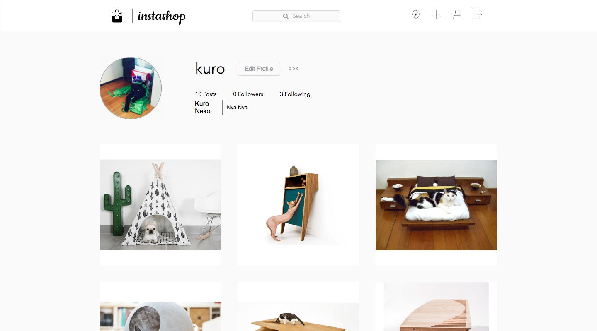
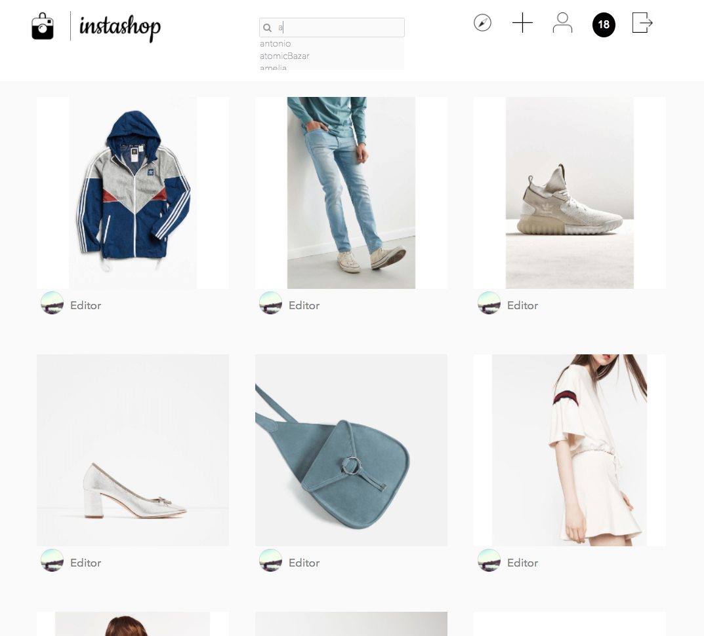
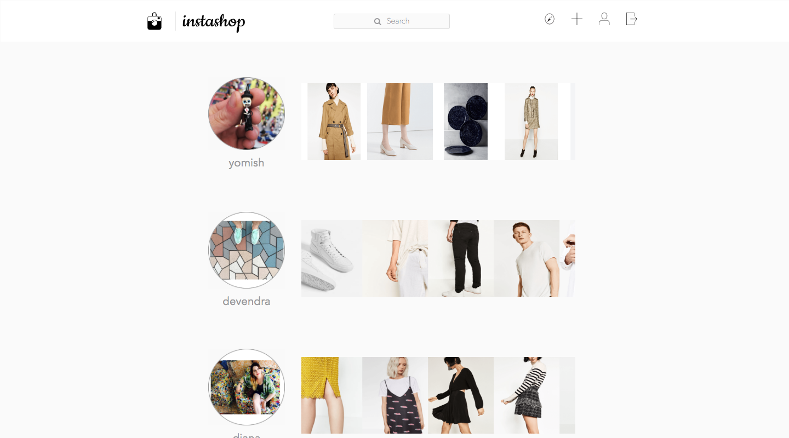

# Instashop

[Instashop Live][heroku]

[heroku]: http://www.insta-shop.io/

Instashop is an application that allows users to curate their own wishlists. Inspired by Instagram built using Ruby on Rails on the backend and React-Redux framework in the frontend.

## Features & Implementation

### Wishlist and Likes

In the users profile they can find all the items in their wishlist. The user can add items to their wishlist by liking another users post or by creating a new post.

### Creating and Rendering Posts

  Creating posts is easy, simply provide the websites url, the image address and the price. It's also possible to add a caption and a category. After submitting the item is posted on your profile.

### Comments

The user is able to leave comments on their posts or other peoples posts.

### Feed and Discover / Follow

In the users feed the user can find the posts of people they are following. In the Discover page the user can find new users to follow.

